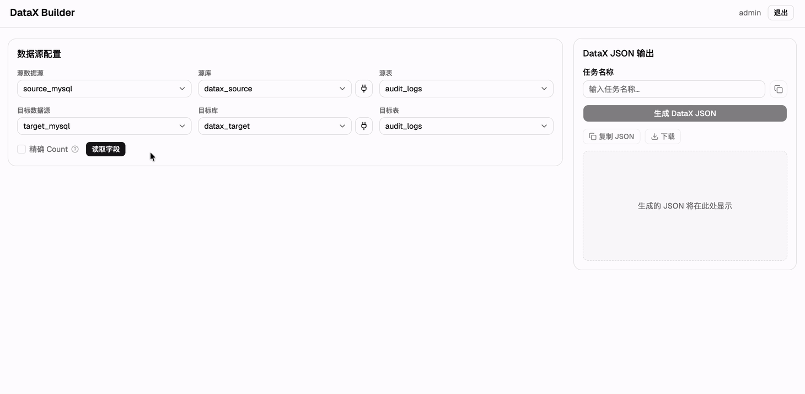

# DataX Builder


DataX 同步任务 JSON 配置生成工具。目前支持 MySQL → MySQL 场景，提供表结构对比、字段映射、类型风险检测、外键处理等功能。

## 演示



## 部署

### 1. 配置

```bash
cp config.yaml.example config.yaml
```

编辑 `config.yaml`，配置以下内容：

- **server** — JWT 密钥、CORS、开发模式开关
- **datasources** — MySQL 数据源连接信息
- **users** — 登录账户及 bcrypt 密码哈希

#### 生成 JWT 密钥

```bash
openssl rand -hex 32
```

将生成的字符串填入 `config.yaml` 的 `server.jwt_secret` 字段。该密钥用于签发登录令牌，更换后所有用户需重新登录。开发环境可留空，生产环境必须设置。

#### 生成密码哈希

构建完成后，通过容器生成：

```bash
docker compose run --rm backend python -c "from passlib.hash import bcrypt; print(bcrypt.hash('your_password'))"
```

或使用 `htpasswd`（需安装 `apache2-utils`）：

```bash
htpasswd -nbBC 12 '' 'your_password' | cut -d: -f2
```

将生成的哈希值填入 `config.yaml` 的 `users.xxx.password_hash` 字段。

> 默认示例账户：`admin` / `admin123`。

### 2. 构建并启动

```bash
docker compose build
docker compose up -d
```

### 3. 修改端口

默认对外端口为 **8080**，可通过 `.env` 文件修改：

```bash
cp .env.example .env
# 编辑 .env 中的 PORT
docker compose up -d
```

### 4. 访问

浏览器打开 `http://服务器IP:8080`（或自定义端口），使用配置的账户登录。

## 本地开发

**后端：**

```bash
cd backend
python -m venv .venv
source .venv/bin/activate
pip install -r requirements.txt
uvicorn app.main:app --reload --port 8000
```

**前端：**

```bash
cd frontend
npm install
npm run dev
```

访问 `http://localhost:5173`，前端开发服务器会自动代理 `/api` 请求到后端。
